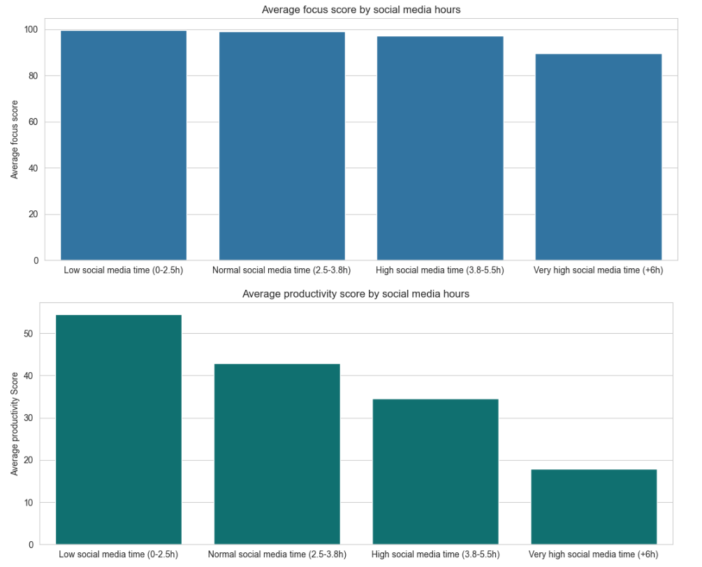
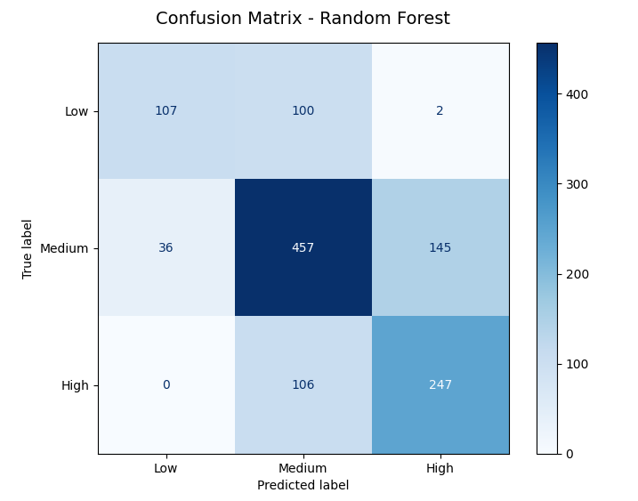

# Social Media Addiction vs Productivity Analysis

## Project Description
Nowadays, everyone has a smartphone or a computer. A marvelous feat of technology, as it is, it comes with some drawbacks. Time spent on those screens has a high potential of reducing productivity. Using a [Kaggle dataset](https://www.kaggle.com/datasets/asifxzaman/social-media-addiction-vs-productivity-dataset) to analyze user behavior, this project aims to perform a comprehensive data science analysis to investigate the relationship between device use, more specifically social media, and individual productivity. This study covers the entire pipeline, from data cleaning and exploratory analysis with a high focus on statistical tests, to the implementation of machine learning models for regression and classification. 

## Technologies and Libraries
The project was developed in Python, utilizing the following libraries:
* **Data Manipulation:** `pandas`, `numpy`, `duckdb`.
* **Visualization:** `matplotlib`, `seaborn`.
* **Statistics & Data Quality:** `statsmodels`, `scipy.stats`, `missdat`.
* **Machine Learning:** `scikit-learn` (Linear Regression, Random Forest, KNNImputer, StandardScaler) and `XGBoost`.

## Dataset Overview
The analysis uses the `social_media_productivity_6000.csv` dataset, containing 6000 records and 9 features, including age, daily screen time, social media hours, study hours, sleep hours, notifications per day, focus score, addiction level, and productivity score.

## Analysis Steps

### 1. Exploratory Data Analysis (EDA)
* Visualized data distributions through histograms to identify normality and outliers.
* A non-parametric pattern emerged in the data, which guided all analysis and statistical tests.
* Conducted segmented analysis revealing that users with "Very high screen time" (+9.5h) suffer a **55% drop in productivity** scores compared to others.
* This productivity drop is even bigger for users with "Very high social media time" (+6h), with a **67% drop**.

* Segmented analysis also showed that even for those very high users, no correlation was found between time spent on devices and sleep or study hours. Those users are probably stealing time from other areas not mapped in the data.
* The amount of daily notifications also does not correlate with screen time and addiction level, which was unexpected. 

### 2. Data Treatment
* **Missing Data:** Roughly 16.7% of users had missing values in their data.
* **MCAR test**: A non-parametric MCAR test (p-value = 0) indicated that this data were not missing at random.
* **Imputation:** For this reason, missing values were handled using `KNNImputer` (n=5) to maintain data integrity instead of simple deletion.

### 3. Machine Learning
Machine learning models were used for two goals: first, learning the most important elements in calculating the productivity score, which can lead to a more specific plan of action to maximize one's productivity. The second goal is to develop a model that predicts a user's addiction level using the available data. Both models were submitted to a 5-Fold Cross-Validation.

## 3.1 Predicting Productivity (Regression)
* **Models tested**: Linear Regression, Random Forest, and XGBoost.
* **Top Performer:** XGBoost achieved an R² of ~0.87 and an RMSE of ~9.83. This means that 87% of the variation in productivity is explained by the features (sleep and study hours, daily screen time, social media time, and the amount of notifications per day) used in the model, and that the average error when evaluating the productivity score of a user was of 9.83%.
* **Key Insight:** A feature importance analysis together with an analysis of the correlation matrix led us to the conclusion that study hours were the strongest positive driver for productivity, while social media hours were the primary negative driver.

## 3.2 Machine Learning: Addiction Level (Classification)
* A classification pipeline was built to predict the user's addiction level.
* **Target Leakage Correction:** Initial models showed near 98% accuracy due to target leakage (addiction level being calculated directly from social media hours).
* **Final Result:** After removing the leaking feature, the models achieved a balanced and realistic accuracy of 67.11%. This result was obtained following a GridSearch optimization that failed to eliminate major errors (low addiction levels predicted as high) in our model.

The major errors were caused by the high variance across supports for the label groups. Medium label data had 638 users to train, while low label data had only 209. Even then, the model was successful, with only 2 major errors in a universe of 1200 test users, and a high balanced accuracy.

## Key Conclusions
* The analysis confirms that social media addiction is directly responsible for decreased productivity.
* Interestingly, the data suggests that high screen time does not necessarily reduce sleep or study hours in this specific dataset, indicating that it may be displacing other activities like leisure or family time, not captured in the data.
* This opens possibilities for new data acquisition and analysis: from where does high screen time take away time? Leisure time? Family time?
* Alternatively, the lack of correlation can be associated with the synthetic production of data in this Kaggle dataset.
* Another consequence of this synthetic production was the target leakage verified in the addiction level classification model.
